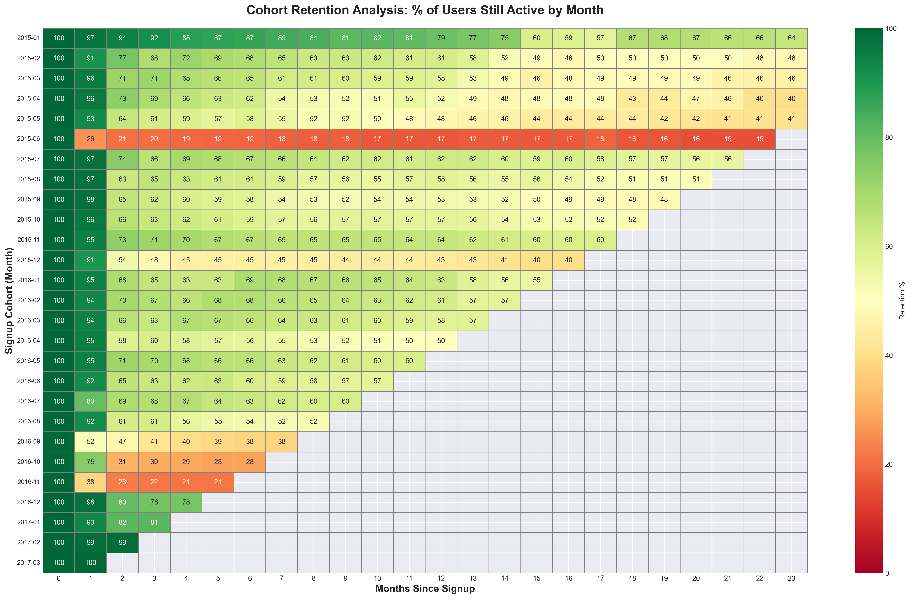
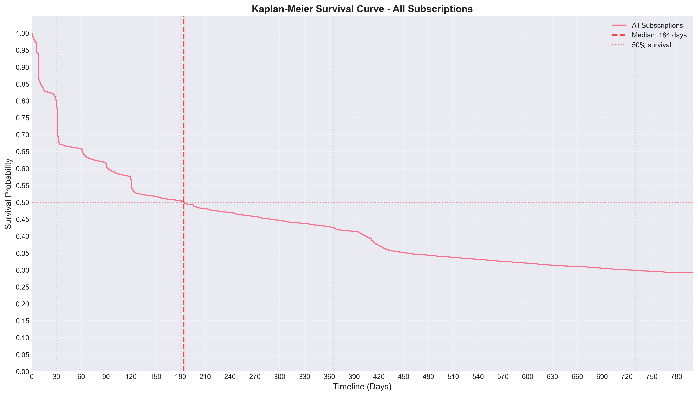
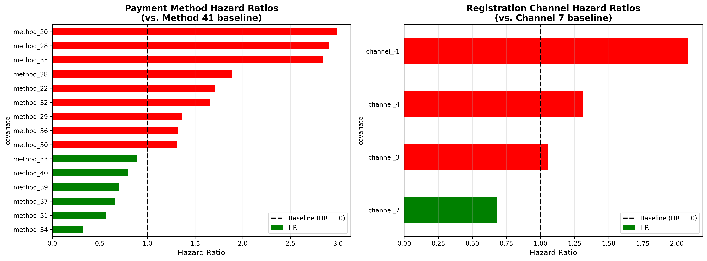

# 🎵 KKBox Subscription Retention: A 360° Survival Analysis

**Predicting Subscriber Lifespan and Identifying Churn Drivers in 2.4M+ Users**

## Project Overview

Subscription churn is the silent killer of SaaS revenue. Using the **KKBox dataset (3.1M+ transactions)**, this project moves beyond simple churn rates to perform a deep-dive longitudinal analysis. By triangulating **Cohort Analysis**, **Kaplan-Meier Survival Curves**, and **Cox Proportional Hazards**, I identified not just _when_ users leave, but the specific financial and behaviuoral "hazards" that cause them to exit.

### Tech Stack

- Language: Python, SQL
- Libraries: `Pandas`, `Lifelines` (Survival Analysis), `Matplotlib/Seaborn` (Visualisation), `NumPy`

### Dataset: 2.4M unique users | 3.1M subscriptions

Source: [WSDM Churn Prediction Challenge on Kaggle](https://www.kaggle.com/c/kkbox-churn-prediction-challenge)

- `transactions.csv` **21.5 million rows** - Historical transaction data from January 2015 through February 2017
- `transactions_v2.csv` **1.3 million rows** - Refreshed transaction log including March 2017
- `members_v3.csv` **6 million rows** - User demographis

---

## Business Insights (TL;DR)

- Churn nearly doubles in Month 2 (**22.3%**) compared to Month 1 (**12.4%**), identifying a critical renewal friction point.
- A typical subscriber stays for 184 days (~6 months).
- Users on Payment Method 20 are **3x** more likely to churn (Hazard Ratio = 3.0) than those on the baseline method.
- 1-year payment plans show near-infinite survival, while 7-day trials are churn magnets with a median survival of only 8 days.

---

## Phase 1: The "When" - Cohort Analysis

I analysed 27 monthly cohorts over a 24-month observation window to establish retention benchmarks.

- Retention stabilises significantly for users who survive the first 90 days.
- The Jan 2015 "Launch Cohort" (549k users) exhibited significantly higher long-term loyalty (**78.9% Year 1 retention**) compared to subsequent steady-state cohorts.
- Identified a major drop-off in the June 2015 cohort (only 25.8% Month 1 retention), likely signaling a technical failure in the signup flow or a low-intent marketing campaign.

_Figure 1: Retention Heatmap identifying the 60-day churn spike and June 2015 anomaly._

---

## Phase 2: The "How Long" - Kaplan-Meier

Using Kaplan-Meier estimates, I quantified the probability of a user reaching specific milestones.

- Only **42.5%** of users reach the 1-year mark, but those who do represent the highest-LTV (Lifetime Value) segment.
- Standard 30-day plans dominate the step-down churn pattern, whereas long-term commitment plans (180+ days) maintain high survival throughout the lifecycle.

_Figure 2: Survival probability across all subscriptions with a median survival of 184 days._

---

## Phase 3: The "Why" - Cox Proportional Hazards

I used a Stratified Cox Model to identify which variables significantly increase the risk (Hazard) of churn.

| Variable                    | Hazard Ratio ($HR$) | Impact                      |
| :-------------------------- | :------------------ | :-------------------------- |
| **Payment Method 20**       | **3.01**            | 200% Increase in Churn Risk |
| **Registration Channel -1** | **2.08**            | 108% Increase in Churn Risk |
| **Registration Channel 7**  | **0.68**            | 32% Reduction in Churn Risk |
| **Payment Method 34**       | **0.34**            | 66% Reduction in Churn Risk |

**Technicality:** Validated model assumptions using Proportional Hazard tests. While the massive scale of the data (3M+ rows) flagged violations, stratification by plan duration was used to ensure robust directional estimates.

_Figure 3: Hazard Ratios for Payment Methods and Registration Channels._

---

## Recommendations

1. **Target the 45-60 Day Window:** Launch automated "Value-Add" email campaigns 15 days before the second renewal to mitigate the observed Month 2 spike.
2. **Financial Migration:** Incentivise users on high-hazard methods (Method 20) to migrate to Method 34 (e.g., through a one-time discount), as Method 34 correlates with a 66% risk reduction.
3. **Product Fit:** Shift acquisition spend away from 7-day trials toward 30-day or 90-day introductory offers to improve the initial "Success Probability."

---

## 📂 Project Structure

- `notebooks/kkbox_survival_data.ipynb`: Initial data cleaning and processing of 22M+ rows.
- `notebooks/kkbox_cohort_retention_analysis.ipynb`: Implementation of Cohort Analysis
- `notebooks/kkbox_survival_exploratory_analysis.ipynb`: Implementation of Kaplan Meier
- `notebooks/kkbox_cox_regression.ipynb`: Implementation of Cox Regression
- `visuals/`: Plots from notebooks

---

### How to Run

1. Clone the repo.
2. Install requirements: `pip install pandas lifelines matplotlib seaborn`.
3. You can access the data via the [WSDM Churn Prediction Challenge on Kaggle](https://www.kaggle.com/c/kkbox-churn-prediction-challenge).
4. Run the notebooks
